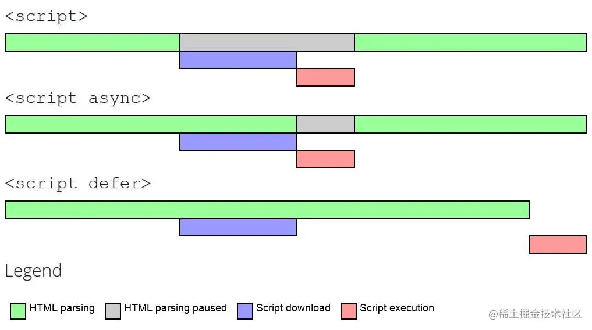

---
## HTML 面试题

## SEO 全方位解决方案

SEO 代表搜寻引擎最佳化/搜寻引擎优化(英文全名Search Engine Optimization，简称SEO)，是指通过了解搜寻引擎的自然排名的算法逻辑，以提高目标网站在有关搜寻引擎内排名的方式。
网站的 SEO 至关重要，它可以让你的网站获得更好的排名和流量，从而提高网站知名度。对于一些盈利的网站，做好seo，还可以以低成本提高投资回报率。
本文将以三个层面展开：

TDK优化
网站质量
SEO手段（10种手段）

一、TDK优化
TDK是Title(页面标题)、Meta Description（页面描述）和Meta Keywords（页面关键词）的缩写，对网站的这三个信息的提炼是网站SEO的重要环节。
但是由于一些原因，各大主流搜索引擎基本都已经大大降低甚至移除了 <keywords> 对排名的影响。例如：

百度：几乎放弃了对<keyword>标签的参考价值。参考：百度官方称：keywords这个meta标签已经被丢进历史垃圾堆了；
谷歌：目前几乎已经不考虑这个标签对于SEO的作用了，它可能更侧重于内容的相关性以及反向链接的考量。参考：# Google 不会将关键字元标记用于网页排名
必应：目前 keywords 标签仍然对排名有一定影响；

（一）title标签-网站名片
title标签相当于网站的名片，他会直接显示在搜索结果中。一个好的标题势必可以为网站带来流量，从而提升网站排名。
注意：网站标题避免冗长
例如：<title>掘金</title>

（二）META标签-网站信息
META标签是网页head区的辅助性标签，它的作用是经过配置一些参数用以描述页面属性。目前几乎所有搜索引擎都使用网上机器人自动查找meta值来给网页分类。

2.1 meta标签如何使用
meta标签的属性有两种：name和http- equiv。
🍀 "name"属性有以下配置项：

Keywords(关键词，现在不再重要了)：逗号分隔的关键词列表（告诉搜索引擎页面是与什么相关的）；
description(网站内容描述，很重要)：页面描述。搜索引擎会把这个描述显示在搜索结果中；
format-detection：格式检测，比如禁止识别电话，邮箱等；
author：作者的名字；
Robots：用来告诉搜索机器人哪些页面需要索引，哪些页面不需要索引；
theme-color：网站主题色；

``` js
<meta name="keywords" content="掘金,稀土,Vue.js,前端面试题,Kotlin,ReactNative,Python">

<meta name="description" content="掘金是面向全球中文开发者的技术内容分享与交流平台。我们通过技术文章、沸点、课程、直播等产品和服务，打造一个激发开发者创作灵感，激励开发者沉淀分享，陪伴开发者成长的综合类技术社区。">

<meta name="format-detection" content="telephone=no">

<meta name="author" content="cece">

<Meta name="Robots" Content="Nofollow">
/** 
all：文件将被检索，且页面上的链接可以被查询；  
none：文件将不被检索，且页面上的链接不可以被查询；(和 "noindex, no follow" 起相同作用)  
index：文件将被检索；（让robot/spider登录）  
follow：页面上的链接可以被查询；  
noindex：文件将不被检索，但页面上的链接可以被查询；(不让robot/spider登录)  
nofollow：文件将不被检索，页面上的链接可以被查询。(不让robot/spider顺着此页的连接往下探找)
*/

<meta name="theme-color" content="#4285f4" />

```
 "http- equiv"属性有以下配置项：
http-equiv顾名思义，相当于http的文件头作用，它可以向浏览器传回一些有用的信息，以帮助正确和精确地显示网页内容。
js复制代码<meta http-equiv="参数"content="参数变量值">；


refresh(期限)：定义文档自动刷新的时间间隔（下面content中的2是指停留2秒钟后自动刷新到URL网址）。这个属性值慎重使用，因为它会使得页面不受用户控制；
set-cookie：如果网页过期，那么存盘的cookie将被删除；

js复制代码<meta http-equiv="refresh" content="2;URL=http://www.baidu.com">

<meta http-equiv="Set-Cookie"content="cookie value=xxx;expires=Friday,12-Jan-200118:18:18GMT；path=/">


2.2 Open Graph 协议标签
Open Graph 协议标签通过 OG Tags （OG 标签）实现的，它属于 Meta 标签的一种，可以用来标识网页类型和元素，让分享到社交网络的内容可以被有效的抓取，还可以控制分享的网站卡片呈现我们想要显示的内容。
只要看到以 og: 为前缀的 Meta 标签就可以判断该网页支持 OG 标签了，如下：
ini复制代码<meta property="og:title" content="设置Open Graph 标签！社交营销优化！">
<meta property="og:site_name" content="前端阿彬">
<meta property="og:type" content="article">
<meta property="og:description" content="Open Graph Protocol（开放图谱协议），简称 OG 协议或 OGP。">

设置og协议前后的网站分享卡片对比：

2.3 关于网站关键词
上面我们也提到了，现在 keywords 关键词已经被各大搜索引擎降低了权重，所以可以设置也可以不设置，但我认为它仍然有他存在的价值。
如果你决定配置网站关键词，需要注意以下几点：

keywords 关键词数量控制在1-4个左右，避免关键词堆砌；
合理选择长尾关键词（长尾关键词一般是2-3个词组成。例如，目标关键词是服装，其长尾关键词可以是男士服装、冬装等），长尾关键词虽然相对核心关键词的搜索量小很多，但是它带来的流量精准度非常高，后期的转化效果更好；
避免使用过于专业的词汇。过于专业的词汇的搜索量较低；
减少使用热门关键词，要选择合适的关键词（搜索量大、转化率高、定位精准）。

2.3 关于网站描述

Description（页面描述）的长度最好控制在120~200个字符；
Description要让用户知道将从页面中获得什么；
在Description中合理使用行动号召（CTA）用语（例如“了解更多”、“立即获取”、“免费试用”等等……）；
Description应该包含页面的核心关键字；
为每个页面创建独一无二的Description；

🌈 二、网站质量
（一）确保页面性能
网站性能是会影响到网站的SEO排名的，原因可想而知：

网站卡顿势必会大大降低网站的用户留存率；
如果网站加载缓慢，搜索引擎就会认为该网站对用户不友好，从而将其排名下降；
影响搜索引擎蜘蛛的爬取频率；
等

参考文章 谷歌将网页加载速度快慢作为影响排名重要因素。
如果你想了解网站性能优化的知识，可以查看我的往期文章 [2023 前端性能优化清单](https://juejin.cn/post/7214026775142760505)

（二）HTML语义化

（三）其他注意点

SEO的禁忌之一就是用JS输出重要的内容。爬虫不会读取JS格式的内容，所以重要的内容必须是HTML格式，这也就是为什么现在流行的spa框架都不利于seo的原因之一；
尽量不使用iFrame。因为搜索引擎不会抓取iframe内的内容，所以重要内容绝对不能放在iframe中；
如果需要截取文字，尽量用css实现，保证文字可以完整呈现给搜索引擎。

 三、SEO手段
（一）各搜索引擎提交站点收录
在各个搜索引擎的站点平台提交网站收录可以缩短爬虫发现网站链接时间，加快爬虫抓取速度。

百度站长资源平台
ziyuan.baidu.com/?castk=LTE%…
谷歌网站管理员工具
www.google.cn/webmasters/
搜狗站长平台
zhanzhang.sogou.com/
360站长平台
zhanzhang.so.com/
头条搜索站长平台
zhanzhang.toutiao.com/
必应网站管理员工具
www.bing.com/webmaster/i…

（二）sitemap站点地图

Sitemap，即站点地图，它是一个网站的全部URL列表，同时可以列出每个网址的其他元数据（上次更新的时间、更改的频率以及相对于网站上其他网址的重要程度为何等）。它可以为搜索引擎的蜘蛛进行导航，更快的找到全站中的所有链接，更全面的获取网站信息。为了保证链接的全面性和准确性，应该自动不定期更新sitemap站点地图。
一般网站的sitemap文件都会有以下两种格式：
sitemap.xml，这是大部分搜索引擎所使用的用于提交网站网址的XML文件；
sitemap.html，这是可直接放在网站上用于用户访问或搜索引擎快速找到全站链接的页面（每页最多500条，自动分页）；
sitemap.xml 文件内容格式大致如下：
``` xml
    <?xml version="1.0" encoding="UTF-8"?>
    <urlset
        xmlns="http://www.sitemaps.org/schemas/sitemap/0.9"
        xmlns:xsi="http://www.w3.org/2001/XMLSchema-instance"
        xsi:schemaLocation="http://www.sitemaps.org/schemas/sitemap/0.9
           http://www.sitemaps.org/schemas/sitemap/0.9/sitemap.xsd"
    >

    <url>
     <loc>https://www.cece.com/</loc>
     <priority>0.3</priority>
     <lastmod>2023-05-17</lastmod>
     <changefreq>weekly</changefreq>
    </url>

    </urlset>
``` 
网上有很多生成sitemap文件的站长工具，例如：
sitemap.zhetao.com/
tools.bugscaner.com/sitemapspid…
生成的sitemap文件一般放在项目根目录下，然后可以在各个搜索引擎的站点平台提交sitemap.xml文件。

（三）robots文件

蜘蛛在访问一个网站时，会首先会检查该网站的根域下是否有一个叫做 robots.txt的纯文本文件，这个文件用于指定spider在您网站上的抓取范围。
如果你有哪些页面不想被蜘蛛访问，则可以通过robots文件告诉蜘蛛不想被搜索引擎收录的部分或者指定搜索引擎只收录特定的部分。
robots文件内容语法：
此文件主要由两种键值对组成：

User-agent:  该项的值用于描述搜索引擎蜘蛛的名字。如果该项的值设为*，则该协议对任何机器人均有效。
Disallow:  该项的值用于描述不希望被访问到的一个URL，一个目录或者整个网站。以Disallow 开头的URL 均不会被搜索引擎蜘蛛访问到。任何一条Disallow 记录为空，说明该网站的所有部分都允许被访问。

``` js
*网站目录下所有文件均能被所有搜索引擎蜘蛛访问*
User-agent: *
Disallow:

*禁止所有搜索引擎蜘蛛访问网站的任何部分*
User-agent: *
Disallow: /

*禁止所有的搜索引擎蜘蛛访问网站的几个目录*
User-agent: *
Disallow: /a/
Disallow: /b/

*只允许某个搜索引擎蜘蛛访问*
User-agent: Googlebot
Disallow: 

```
使用场景举例：

将一些不重要的页面配置在robots 文件中，集中蜘蛛爬取的权重；
虽然 robots 文件是用于通知蜘蛛忽略哪些文件的爬取的，但是每当用户试图访问某个不存在的URL时，服务器都会在日志中记录404错误（无法找到文件）。每当搜索蜘蛛来寻找并不存在的robots.txt文件时，服务器也将在日志中记录一条404错误，所以建议还是添加一个robots.txt。
避免服务器上的一些文件被蜘蛛访问，例如后台管理文件、程序脚本、附件、数据库文件、编码文件、样式表文件、模板文件、导航图片和背景图片等等，例如设置Disallow: /data/ 数据库文件；
避免访问时出错，例如不能让用户直接进入购物车页面，否则会报错，所以要用 robots 文件告诉蜘蛛，阻止这个页面被搜索引擎收录；
如果你的网站是动态网页，并且你为这些动态网页创建了静态副本，以供搜索蜘蛛更容易抓取。那么你需要在robots.txt文件里设置避免动态网页被蜘蛛索引，以保证这些网页不会被视为含重复内容。
将sitemap站点地图配置在robots文件中允许蜘蛛访问。这样站长就不需要在每个搜索引擎的站长平台去提交网站的sitemap 文件，搜索引擎的蜘蛛自己就会抓取robots.txt文件，读取其中的sitemap路径，接着抓取其中链接的网页。但是目前国内的搜索引擎基本都不支持此配置。

robots 文件使用方法：
使用方法非常简单，只需要将 robots.txt 文件上传到网站根目录就行了，注意文件名一定要全小写。当成功上传后，通常在浏览器中访问域名/robots.txt就可以查看到文件。

（四）内链｜外链
在搜索引擎优化领域，有着内链为王、外链为皇的说法，它们都能对提升网站排名有所帮助，尤其是外链的建设。
先来区分下网站内链和外链：

内链：从自己网站的一个页面指向另外一个页面。通过内链让网站内部形成网状结构，让蜘蛛的广度和深度达到最大化。
外链：在别的网站导入自己网站的链接。通过外链提升网站权重，提高网站流量。外链有以下几个好处：

提升网站权重
能够吸引蜘蛛来抓取网站
提升关键词排名
提升网址或品牌的曝光度
给网站带来流量


外链能够为我们的网站带来流量，所以外链数量越多越好是必然的。但是，一定要注意外链的质量，例如对方网站没有被搜索引擎收录，对方网站性能过差，死链等，这些低质量的外链反而会影响到本站的排名。
另外，在添加内链外链的过程中，要注意在 a 标签中对 nofollow 和·external 属性的使用。

<a> 标签的 rel 属性用于指定当前文档与被链接文档的关系。

rel=nofollow使用说明 >>>
js复制代码<a rel="nofollow" href="http://www.baidu.com/">百度</a>

带有rel=nofollow 属性的链接会告诉搜索引擎忽略这个链接。阻止搜索引擎对该页面进行追踪。从而避免权重分散。这个属性只对搜索引擎有效，这是一个纯粹的SEO优化标签。
使用场景：

屏蔽一些垃圾链接，比如网站上面评论里面的站外链接，论坛里面用户留下的链接等；
外链的内容与本站无关时，建议使用nofollow；


外链站点不稳定，性能较差时，建议使用nofollow；
友链一般作为网站交换链接，互惠互利，是不会设置nofollow的，所以在交换友链之前，一定要对对方的网站质量进行审核；
内部链接密度过大，页面重要性不高时，可以使用nofoolw，例如很多网站常有的“关于我们”页面，比如掘金的：


并不是内容无关的外链都要加nofollow。适当的添加高质量的外链，对于SEO是没有坏处的，还会产生正向影响，所以关键就在于外链的质量和数量上。例如掘金的友链：


rel=external使用说明 >>>
js复制代码<a rel="external" href="http://www.baidu.com/">百度</a>

external字面意思是“外部的”，a 标签加上这个属性代表这个链接是外部链接，非本站链接，点击时会在新窗口中打开，它和target="_blank"效果一样。external 可以告诉搜索引擎这是一个外部链接，非本站的链接。


（五）Canonical URL（网址规范化）
什么是网址规范化？简单举个例子：
juejin.cn
www.juejin.cn
www.juejin.cn/index.html
这几个网址虽然url不同，搜索引擎也确实把他当作不同的网址，但是其实这些网址返回的都是同一个页面，这就是不规范网址。
网页规范化的两个好处：

解决网站由于网站url链接不一样，但网页内容是一样而造成搜索引擎重复收录的问题；
有利于URL权重集中。

解决方法：
在页面的head 标签中，加入以下canonical标签，指定规范化网址。
bash复制代码<head>
  <link rel="canonical" href="href="https://juejin.cn"/>
</head>

（六）网站301重定向
301/302重定向是 SEO优化中一种重要的自动转向技术。301重定向是当搜索引擎向网站服务器发出访问请求时，服务返回的HTTP数据流中头信息(header)部分状态码的一种，表示本网址永久性转移到另一个地址。302重定向则表示暂时转移。
301重定向与上一点所说的网址规范化有着类似的作用，与此同时，它还具有以下作用：

集中域名权重，301 网址跳转其实是对域名权重进行转移，比如 www.juejin.cn 重定向到 juejin.cn，其实是把 www.juejin.cn 的权重转移到了 juejin.cn，从而增加 juejin.cn 域名的权重；
避免重复收录；
网页PR（PageRank-网页级别）是用来评估一个网站页面相对于网站其他页面重要性的一个算法，301定向跳转有利于网站PR的传递；
优化用户体验，网址规范化可以让用户更好地记住我们的网站，可以将域名统一重定向到某一个域名，增加网站的记忆度，获取更好的用户体验。

虽然canonical标签可以规范化网址，但是以下四种情况必须配置301重定向：

网站替换域名后，通过301永久重定向旧域名重定向到新域名，弥补流量损失和SEO;
如果删除掉网站中的一些页面，但是这个页面有一定的流量和权重，可以利用301重定向到合适的页面避免流量流失；
网站改版或因为其他原因导致页面地址发生变化，为避免出现死链接，可以通过 301 重定向来解决；
如果您有多个空闲的域名需要指向相同的站点，则可以使用301永久重定向；

如何验证301重定向是否生效：
可以使用站长工具[HTTP状态查询](https://tool.chinaz.com/pagestatus/) 查看返回的状态码是否为301。

（七）网站设置伪静态页面

伪静态页面是指动态网页通过重写URL的方法实现去掉动态网页的参数,但在实际的网页目录中并没有必要实现存在重写的页面。

动态页面通常是php或者asp等语言结合数据库，通过代码调用数据来实现页面展示。
伪静态化就是将动态页面的url转换成以 .html 等结尾的静态页面url，以增强搜索引擎的友好性（符合搜索引擎的抓取规则），同时方便用户输入和记忆。
举个例子：
比如有个asp动态页面：http://127.0.0.1/test.asp?id=1234
在伪静态化后，就可以通过类似的url访问这个页面： http://127.0.0.1/test_1234.html
一般实现手段是在 nginx/apache 等服务器配置rewrite重写规则，将动态url转变为静态url。


（八）使用HTTPS
谷歌曾发公告表示，使用安全加密协议（HTTPS），是搜索引擎排名的一项参考因素。
所以，在域名相同情况下，HTTPS站点比HTTP站点，能获得更好的排名。


（九）SSR服务端渲染（ Server-Side Rendering）
当下SPA应用盛行，虽然它有用户体验好，服务器压力小等优点，但是同时也暴露出很多问题。例如首屏加载较慢，不利于SEO等（因为这些spa应用内容是由js动态更新的，蜘蛛无法爬取网页内容）。
而ssr的出现，很好的解决了seo的问题。因为服务端渲染是指指客户端向服务器发出请求，然后运行时动态生成 html 内容并返回给客户端。所以客户端可以获取到完整的页面内容。
目前流行的 Vue/React 前端框架，都有SSR的解决方案：
Vue的nuxt.js
React的next.js
对于 Vue/React 来说，对于它们的 SSR/SSG 框架出现的原因就是主要就是 SEO 和首屏加载速度。
（十）预渲染prerender-spa-plugin
如果你只想改善部分页面的SEO，可以不采用 SSR 的解决方案，毕竟无论是next.js，还是nuxt.js，都是有一定学习成本的。那么你可以使用 prerender-spa-plugin 等插件来实现预渲染页面，在构建时就针对特定的路有生成静态的 html 文件。
了解更多


## 1.1 如何理解 HTML 语义化？

让人更容易读懂（增加代码可读性）。
让搜索引擎更容易读懂，有助于爬虫抓取更多的有效信息，爬虫依赖于标签来确定上下文和各个关键字的权重（SEO）。
在没有 CSS 样式下，页面也能呈现出很好地内容结构、代码结构。

1.2 script 标签中 defer 和 async 的区别？

script ：会阻碍 HTML 解析，只有下载好并执行完脚本才会继续解析 HTML。
async script ：解析 HTML 过程中进行脚本的异步下载，下载成功立马执行，有可能会阻断 HTML 的解析。
defer script：完全不会阻碍 HTML 的解析，解析完成之后再按照顺序执行脚本。

下图清晰地展示了三种 script 的过程：



# 1.3 从浏览器地址栏输入 url 到请求返回发生了什么

## 前置内容 浏览器主要进程

## 第一部分 输入网址并解析

## 第二部分 TCP/IP连接：三次握手

##  第三部分 HTTP请求

###  HTTP 发展历史
HTTP/0.9

 只有一个命令GET
 响应类型: 仅 超文本
 没有header等描述数据的信息
 服务器发送完毕，就关闭TCP连接

HTTP/1.0

 增加了很多命令（post HESD ）
 增加status code 和 header
 多字符集支持、多部分发送、权限、缓存等
 响应：不再只限于超文本 (Content-Type 头部提供了传输 HTML 之外文件的能力 — 如脚本、样式或媒体文件)

HTTP/1.1

 持久连接。TCP三次握手会在任何连接被建立之前发生一次。最终，当发送了所有数据之后，服务器发送一个消息，表示不会再有更多数据向客户端发送了；则客户端才会关闭连接（断开 TCP）
 支持的方法: GET , HEAD , POST , PUT ,DELETE , TRACE , OPTIONS
 进行了重大的性能优化和特性增强，分块传输、压缩/解压、内容缓存磋商、虚拟主机（有单个IP地址的主机具有多个域名）、更快的响应，以及通过增加缓存节省了更多的带宽

HTTP2

 所有数据以二进制传输。HTTP1.x是基于文本的，无法保证健壮性，HTTP2.0绝对使用新的二进制格式，方便且健壮
 同一个连接里面发送多个请求不再需要按照顺序来
 头信息压缩以及推送等提高效率的功能

HTTP3

 QUIC“快速UDP互联网连接”（Quick UDP Internet Connections）

HTTP3 的主要改进在传输层上。传输层不会再有我前面提到的那些繁重的 TCP 连接了。现在，一切都会走 UDP。


HTTP协议特点


支持客户/服务器模式。


简单快速客户向服务器请求服务时，只需传送请求方法和路径。请求方法常用的有 GET、HEAD、POST。每种方法规定了客户与服务器联系的类型不同。由于 HTTP协议简单，使得HTTP服务器的程序规模小，因而通信速度很快。


灵活：HTTP允许传输任意类型的数据对象。正在传输的类型由Content-Type（Content-Type是HTTP包中用来表示内容类型的标识）加以标记。


无连接：无连接的含义是限制每次连接只处理一个请求。服务器处理完客户的请求，并收到客户的应答后，即断开连接。采用这种方式可以节省传输时间。


无状态：HTTP协议是无状态协议。无状态是指协议对于事务处理没有记忆能力。缺少状态意味着如果后续处理需要前面的信息，则它必须重传，这样可能导致每次连接传送的数据量增大。另一方面，在服务器不需要先前信息时它的应答就较快。


现在 HTTP3 最快！


各协议与HTTP协议关系

DNS 服务：解析域名至对应的IP地址
HTTP 协议：生成针对目标Web服务器的HTTP请求报文
TCP 协议：将请求报文按序号分割成多个报文段
IP 协议：搜索对方的地址，一边中转一边传送
TCP 协议：按序号以原来的顺序重组请求报文请求的处理结果也同样利用TCP/IP协议向用户进行回传

TCP是底层通讯协议，定义的是数据传输和连接方式的规范；

HTTP是应用层协议，定义的是传输数据的内容的规范；
HTTP协议中的数据是利用TCP协议传输的，所以支持HTTP也就一定支持TCP。


### HTTPS

在HTTP的基础上再加一层TLS（传输层安全性协议）或者SSL（安全套接层），就构成了HTTPS协议。
HTTPS 默认工作在 TCP 协议443端口，它的工作流程一般如以下方式：

TCP 三次同步握手
客户端验证服务器数字证书
DH 算法协商对称加密算法的密钥、hash 算法的密钥
SSL 安全加密隧道协商完成
网页以加密的方式传输，用协商的对称加密算法和密钥加密，保证数据机密性；用协商的hash算法进行数据完整性保护，保证数据不被篡改。

TLS 握手的关键在于利用通信双发生成的随机字符串和服务端的证书公钥生成一个双方经过协商后的对称密钥，这样通信双方就可以使用这个对称密钥在后续的数据传输中加密消息数据，防止中间人的监听和攻击，保证通讯安全。

HTTPS连接 需要7次握手，3次TCP + 4次TLS。


## 第四部分 服务器处理请求并返回 HTTP 报文

每台服务器上都会安装处理请求的应用——Web Server。常见的Web Server 产品有 apache、nginx、IIS 或 Lighttpd 等。
HTTP请求一般可以分为两类，静态资源 和 动态资源。
请求访问静态资源，这个就直接根据url地址去服务器里找就好了。
请求动态资源的话，就需要web server把不同请求，委托给服务器上处理相应请求的程序进行处理（例如 CGI 脚本，JSP 脚本，servlets，ASP 脚本，服务器端 JavaScript，或者一些其它的服务器端技术等），然后返回后台程序处理产生的结果作为响应，发送到客户端。
服务器在处理请求的时候主要有三种方式：

第一种：是用一个线程来处理所有的请求，并且同时只能处理一个请求，但是这样的话性能是非常的低的。
第二种：是每一个请求都给他分配一个线程但是当链接和请求比较多的时候就会导致服务器的cpu不堪重负。
第三种：就是采用复用I/O的方式来处理例如通过epoll方式监视所有链接当链接状态发生改变的时候才去分配空间进行处理。

## 第五部分 浏览器渲染页面

## 第六部分 断开连接：TCP 四次挥手

刚开始双方都处于established状态，假如是客户端先发起关闭请求
第一次挥手：客户端发送一个FIN报文，报文中会指定一个序列号。此时客户端处于FIN_WAIT1状态
第二次挥手：服务端收到FIN之后，会发送ACK报文，且把客户端的序列号值+1作为ACK报文的序列号值，表明已经收到客户端的报文了，此时服务端处于CLOSE_WAIT状态
第三次挥手：如果服务端也想断开连接了，和客户端的第一次挥手一样，发送FIN报文，且指定一个序列号。此时服务端处于LAST_ACK的状态
需要过一阵子以确保服务端收到自己的ACK报文之后才会进入CLOSED状态，服务端收到ACK报文之后，就处于关闭连接了，处于CLOSED状态。


挥手为什么需要四次？

因为当服务端收到客户端的SYN连接请求报文后，可以直接发送SYN+ACK报文。其中ACK报文是用来应答的，SYN报文是用来同步的。但是关闭连接时，当服务端收到FIN报文时，很可能并不会立即关闭SOCKET，所以只能先回复一个ACK报文，告诉客户端，“你发的FIN报文我收到了”。只有等到我服务端所有的报文都发送完了，我才能发送FIN报文，因此不能一起发送。故需要四次挥手。

为什么客户端发送ACK之后不直接关闭，而是要等一阵子才关闭？

客户端收到服务端的连接释放报文段后，对此发出确认报文段（ACK=1，seq=u+1，ack=w+1），客户端进入TIME_WAIT（时间等待）状态。此时TCP未释放掉，需要经过时间等待计时器设置的时间2MSL后，客户端才进入CLOSED状态。如果不等待，客户端直接跑路，当服务端还有很多数据包要给客户端发，且还在路上的时候，若客户端的端口此时刚好被新的应用占用，那么就接收到了无用数据包，造成数据包混乱。

为什么TIME_WAIT状态需要经过2MSL（最大报文生存时间）才能返回到CLOSE状态？
理论上，四个报文都发送完毕，就可以直接进入CLOSE状态了，但是可能网络是不可靠的，有可能最后一个ACK丢失。所以TIME_WAIT状态就是用来重发可能丢失的ACK报文。
1 个 MSL 确保四次挥手中主动关闭方最后的 ACK 报文最终能达到对端；
1 个 MSL 确保对端没有收到 ACK 重传的 FIN 报文可以到达。


## 总结


浏览器主进程处理用户 URL 输入：

触发旧页面的 beforeunload 事件；
判断是搜索内容还是页面请求的 URL；

如果是搜索内容，地址栏会使用浏览器默认的搜索引擎，来合成新的带搜索关键字的URL。
如果判断输入内容符合URL规则，比如输入的是 juejin.cn 那么地址栏会根据规则，把这段内容加上协议，合成为完整的URL，如 https://juejin.cn。


浏览器主进程把收到的 URL 转给网络进程；


网络进程处理 HTTP 请求：

构建请求；
查找缓存，有缓存就直接返回了；
DNS (基于 UDP)解析，准备 IP 地址及端口号（递归查询，迭代查询），如果没有端口号，http默认80，https默认443；
等待 TCP 队列；
建立 TCP 连接，三次握手（为了确认客户端和服务端的接收和发送能力）；
如果是https请求 还有TSL，四次握手；
排队等待，最多可以发送6个http请求，发送 HTTP 请求（请求行 请求头 请求体）；

chrome 针对同一域名只能建立6个tcp链接，
同一域名下，同一GET请求的并发数是1，也就是说上一个请求结束，才会执行下一个请求，否则置入队列等待发送；
同一域名下，不同GET/POST请求的并发数量是6。当发送的请求数量达到6个，并且都没有得到响应时，后面的请求会置入队列等待发送


检查状态码

如果是301/302，则需要重定向，从Location自动中读取地址，重新进行第4步 ，如果是200，则继续处理请求。
200响应处理：检查响应类型Content-Type，如果是字节流类型，则将该请求提交给下载管理器，该导航流程结束，不再进行后续的渲染，如果是html则通知浏览器进程准备渲染进程准备进行渲染。
304 去查询浏览器缓存进行返回（协商缓存）
http/1.1 默认是不会断开(keep-alive)

断开 TCP 连接，四次挥手（接收完响应数据后才会断开 TCP 连接）；


准备渲染进程、提交文档、确认文档被提交

网络进程收到响应头数据，将数据发送给浏览器主进程；
浏览器主进程收到网络进程传来的响应头数据，准备渲染进程；

浏览器进程检查当前url是否和之前打开的渲染进程根域名是否相同，如果相同，则复用原来的进程，如果不同，则开启新的渲染进程


准备好渲染进程后，浏览器主进程向渲染进程发起“提交文档”的消息；
渲染进程收到浏览器主进程传来的“提交文档”消息，之后会与网络进程建立传输 HTML 页面数据管道；
当网络进程中的响应体接收完毕，通过管道将 HTML 页面数据传输给渲染进程；
当 HTML 页面数据传输完成后，渲染进程会返回“确认文档提交”消息给浏览器主进程；
浏览器主进程收到“确认文档提交”消息后，就会更新浏览器界面的状态，比如安全状态、地址栏 URL、历史记录状态，并刷新 Web 页面；


渲染阶段

渲染进程将 HTML 脚本解析成浏览器能识别处理的 DOM 树；
渲染进程将 CSS 脚本解析成浏览器能识别处理的 styleSheets，标准化处理属性值，并完成各节点的样式计算；
创建布局树，忽略不可见的节点，进行布局计算，并将节点的布局信息重写回布局树；
对布局树进行分层，生成分层树（Layer Tree）；如一些复杂的3D变换、页面滚动，或者使用z-indexing做z轴排序等，为了更加方便地实现这些效果，渲染引擎还需要为特定的节点生成专用的图层，并生成一棵对应的图层树（LayerTree）
为每个图层生成绘制列表，并提交给合成线程；（每个图层有自己的绘制步骤）
合成线程进行分块，并在栅格化线程池中将图块转化为位图（含 GPU 栅格化）；（有的图层，太大了，需要滚动才能出现在视口中，这种就需要分块，没必要一次性渲染，影响性能！）

通常，栅格化过程都会使用GPU来加速生成，使用GPU生成位图的过程叫快速栅格化，或者GPU栅格化，生成的位图被保存在GPU内存中。


浏览器主进程viz组件收到合成线程的绘制指令 DrawQuad，先在内存中绘制页面，并最终显示在浏览器标签页上。
