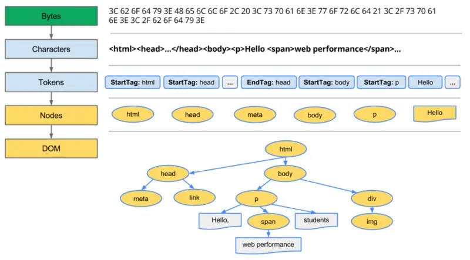

---
## 从浏览器地址栏输入 url 到请求返回发生了什么

[从输入URL开始建立前端知识体系](https://juejin.cn/post/6935232082482298911)

解析URL
输入URL后，浏览器会解析出协议、主机、端口、路径等信息，并构造一个HTTP请求。

浏览器发送请求前，根据请求头的expires和cache-control判断是否命中（包括是否过期）强缓存策略，如果命中，直接从缓存获取资源，并不会发送请求。如果没有命中，则进入下一步。
没有命中强缓存规则，浏览器会发送请求，根据请求头的If-Modified-Since和If-None-Match判断是否命中协商缓存，如果命中，直接从缓存获取资源。如果没有命中，则进入下一步。
如果前两步都没有命中，则直接从服务端获取资源。


浏览器缓存

强缓存
强制缓存就是向浏览器缓存查找该请求结果，并根据该结果的缓存规则来决定是否使用该缓存结果的过程。强缓存又分为两种Expires和Cache-Control

Expires
版本：HTTP/1.0
来源：存在于服务端返回的响应头中
语法：Expires: Wed, 22 Nov 2019 08:41:00 GMT
缺点：服务器的时间和浏览器的时间可能并不一致导致失效


Cache-Control
版本：HTTP/1.1
来源：响应头和请求头
语法：Cache-Control:max-age=3600
缺点：时间最终还是会失效


请求头：

字段名称 | 说明
no-cache | 告知(代理)服务器不直接使用缓存，要求向原服务器发起请求
no-store | 所有内容都不会被保存到缓存或Internet临时文件中
max-age=delta-seconds | 告知服务器客户端希望接收一个存在时间不大于delta-secconds秒的资源
max-stale[=delta-seconds] | 告知(代理)服务器客户端愿意接收一个超过缓存时间的资源，若有定义delta-seconds则为delta-seconds秒，若没有则为任意超出时间
min-fresh=delta-seconds | 告知(代理)服务器客户端希望接收一个在小于delta-seconds秒内被更新过的资源
no-transform | 告知(代理)服务器客户端希望获取实体数据没有被转换(比如压缩)过的资源
noly-if-cached | 告知(代理)服务器客户端希望获取缓存的内容(若有),而不用向原服务器发去请求
cache-extension | 自定义扩展值，若服务器不识别该值将被忽略掉


响应头：

字段名称 | 说明
public | 表明任何情况下都得缓存该资源(即使是需要HTTP认证的资源)
Private=[field-name] | 表明返回报文中全部或部分(若指定了field-name则为field-name的字段数据)仅开放给某些用户(服务器指定的share-user，如代理服务器)做缓存使用，其他用户则不能缓存这些数据
no-cache | 不直接使用缓存，要求向服务器发起(新鲜度校验)请求
no-store | 所以内容都不会被保存到缓存或Internet临时文件中
no-transform | 告知客户端缓存文件时不得对实体数据做任何改变
noly-if-cached | 告知(代理)服务器客户端希望获取缓存的内容(若有),而不用向原服务器发去请求must-revalidate | 当前资源一定是向原方法服务器发去验证请求的，如请求是吧会返回504(而非代理服务器上的缓存)
proxy-revalidate | 与must-revalidate类似，但仅能应用于共享缓存(如代理)
max-age=delta-seconds | 告知客户端该资源在delta-seconds秒内是新鲜的，无需向服务器发请求
s-maxage=delta-seconds | 同max-age，但仅能应用于共享缓存(如代理)
cache-extension | 自定义扩展值，若服务器不识别该值将被忽略掉

demo:
``` javascript
// server.js
const http = require('http')
const fs = require('fs')

http.createServer(function (request, response) {
  console.log('request come', request.url)

  if (request.url === '/') {
    const html = fs.readFileSync('test.html', 'utf8')
    response.writeHead(200, {
      'Content-Type': 'text/html'
    })
    response.end(html)
  }

  if (request.url === '/script.js') {
    response.writeHead(200, {
      'Content-Type': 'text/javascript',
      'Cache-Control': 'max-age=20,public' // 缓存20s 多个值用逗号分开
    })
    response.end('console.log("script loaded")')
  }
}).listen(8888)

console.log('server listening on 8888')
```


协商缓存

协商缓存就是强制缓存失效后，浏览器携带缓存标识向服务器发起请求，由服务器根据缓存标识决定是否使用缓存的过程。

模拟Last-Modified

``` javascript
if (request.url === '/index.js') {
   const filePath = path.join(__dirname, request.url); // 拼接当前脚本文件地址
    const stat = fs.statSync(filePath); // 获取当前脚本状态
    const mtime = stat.mtime.toGMTString() // 文件的最后修改时间
    const requestMtime = request.headers['if-modified-since']; // 来自浏览器传递的值

    console.log(stat);
    console.log(mtime, requestMtime);

    // 走协商缓存
    if (mtime === requestMtime) {
      response.statusCode = 304;
      response.end();
      return;
    }

    // 协商缓存失效，重新读取数据设置 Last-Modified 响应头
    console.log('协商缓存 Last-Modified 失效');
    response.writeHead(200, {
        'Content-Type': 'text/javascript',
        'Last-Modified': mtime,
    });

    const readStream = fs.createReadStream(filePath);
    readStream.pipe(response);
  }
```

模拟ETag
``` javascript
if (request.url === '/index.js') {
    const filePath = path.join(__dirname, request.url); // 拼接当前脚本文件地址
    const buffer = fs.readFileSync(filePath); // 获取当前脚本状态
    const fileMd5 = md5(buffer); // 文件的 md5 值
    const noneMatch = request.headers['if-none-match']; // 来自浏览器端传递的值

    if (noneMatch === fileMd5) {
        response.statusCode = 304;
        response.end();
        return;
    }

    console.log('Etag 缓存失效');
    response.writeHead(200, {
        'Content-Type': 'text/javascript',
        'Cache-Control': 'max-age=0',
        'ETag': fileMd5,
    });

    const readStream = fs.createReadStream(filePath);
    readStream.pipe(response);
  }
```


Last-Modified(响应头)，If-Modified-Since(请求头)
在浏览器第一次给服务器发送请求后，服务器会在响应头中加上这个字段。
浏览器接收到后，如果再次请求，会在请求头中携带If-Modified-Since字段，这个字段的值也就是服务器传来的最后修改时间。
服务器拿到请求头中的If-Modified-Since的字段后，其实会和这个服务器中该资源的最后修改时间Last-Modified对比,询问服务器在该日期后资源是否有更新，有更新的话就会将新的资源发送回来。
但是如果在本地打开缓存文件，就会造成 Last-Modified 被修改，所以在 HTTP / 1.1 出现了 ETag。
ETag(响应头)、If-None-Match(请求头)

ETag是服务器根据当前文件的内容，给文件生成的唯一标识，只要里面的内容有改动，这个值就会变。服务器通过响应头把这个值给浏览器。
浏览器接收到ETag的值，会在下次请求时，将这个值作为If-None-Match这个字段的内容，并放到请求头中，然后发给服务器。

如果两种方式都支持的话，服务器会优先考虑ETag

存储位置

Service Worker

Service Worker 是运行在浏览器背后的独立线程，一般可以用来实现缓存功能。使用 Service Worker的话，传输协议必须为 HTTPS。因为 Service Worker 中涉及到请求拦截，所以必须使用 HTTPS 协议来保障安全。Service Worker 的缓存与浏览器其他内建的缓存机制不同，它可以让我们自由控制缓存哪些文件、如何匹配缓存、如何读取缓存，并且缓存是持续性的。
Service Worker 实现缓存功能一般分为三个步骤：首先需要先注册 Service Worker，然后监听到 install 事件以后就可以缓存需要的文件，那么在下次用户访问的时候就可以通过拦截请求的方式查询是否存在缓存，存在缓存的话就可以直接读取缓存文件，否则就去请求数据。
当 Service Worker 没有命中缓存的时候，我们需要去调用 fetch 函数获取数据。也就是说，如果我们没有在 Service Worker 命中缓存的话，会根据缓存查找优先级去查找数据。但是不管我们是从 Memory Cache 中还是从网络请求中获取的数据，浏览器都会显示我们是从 Service Worker中获取的内容。

Memory Cache

Memory Cache 也就是内存中的缓存，主要包含的是当前中页面中已经抓取到的资源,例如页面上已经下载的样式、脚本、图片等。读取内存中的数据肯定比磁盘快,内存缓存虽然读取高效，可是缓存持续性很短，会随着进程的释放而释放。 一旦我们关闭Tab页面，内存中的缓存也就被释放了。
那么既然内存缓存这么高效，我们是不是能让数据都存放在内存中呢？
这是不可能的。计算机中的内存一定比硬盘容量小得多，操作系统需要精打细算内存的使用，所以能让我们使用的内存必然不多。

需要注意的事情是，内存缓存在缓存资源时并不关心返回资源的HTTP缓存头Cache-Control是什么值，同时资源的匹配也并非仅仅是对URL做匹配，还可能会对Content-Type，CORS等其他特征做校验。


Disk Cache

Disk Cache 也就是存储在硬盘中的缓存，读取速度慢点，但是什么都能存储到磁盘中，比之 Memory Cache 胜在容量和存储时效性上。

Push Cache

Push Cache（推送缓存）是 HTTP/2 中的内容，当以上三种缓存都没有命中时，它才会被使用。它只在会话（Session）中存在，一旦会话结束就被释放，并且缓存时间也很短暂，在Chrome浏览器中只有5分钟左右，同时它也并非严格执行HTTP头中的缓存指令。

所有的资源都能被推送，并且能够被缓存,但是 Edge 和 Safari 浏览器支持相对比较差
可以推送 no-cache 和 no-store 的资源
一旦连接被关闭，Push Cache 就被释放
多个页面可以使用同一个HTTP/2的连接，也就可以使用同一个Push Cache。这主要还是依赖浏览器的实现而定，出于对性能的考虑，有的浏览器会对相同域名但不同的tab标签使用同一个HTTP连接。
Push Cache 中的缓存只能被使用一次
浏览器可以拒绝接受已经存在的资源推送
你可以给其他域名推送资源


[从URL输入到页面展现到底发生什么？](https://juejin.cn/post/6844903784229896199)

从开发&运维角度方面来看，总体来说分为以下几个过程：

DNS 解析:将域名解析成 IP 地址
TCP 连接：TCP 三次握手
发送 HTTP 请求
服务器处理请求并返回 HTTP 报文
浏览器解析渲染页面
断开连接：TCP 四次挥手

一、什么是URL？
URL（Uniform Resource Locator），统一资源定位符，用于定位互联网上资源，俗称网址。

scheme: // host.domain:port / path / filename ? abc = 123 # 456789

scheme       - 定义因特网服务的类型。常见的协议有 http、https、ftp、file，
               其中最常见的类型是 http，而 https 则是进行加密的网络传输。
host         - 定义域主机（http 的默认主机是 www）
domain       - 定义因特网域名，比如 baidu.com
port         - 定义主机上的端口号（http 的默认端口号是 80）
path         - 定义服务器上的路径（如果省略，则文档必须位于网站的根目录中）。
filename     - 定义文档/资源的名称
query        - 即查询参数
fragment     - 即 # 后的hash值，一般用来定位到某个位置


二、DNS域名解析
在浏览器输入网址后，首先要经过域名解析，因为浏览器并不能直接通过域名找到对应的服务器，而是要通过 IP 地址。

IP 地址

复制代码IP 地址是指互联网协议地址，是 IP Address 的缩写。IP 地址是 IP 协议提供的一种统一的地址格式，
它为互联网上的每一个网络和每一台主机分配一个逻辑地址，以此来屏蔽物理地址的差异。

什么是域名解析

复制代码DNS 协议提供通过域名查找 IP 地址，或逆向从 IP 地址反查域名的服务。
DNS 是一个网络服务器，我们的域名解析简单来说就是在 DNS 上记录一条信息记录。

浏览器如何通过域名去查询 URL 对应的 IP 呢？

复制代码DNS域名解析分为递归查询和迭代查询两种方式，现一般为迭代查询。


DNS的优化与应用


DNS缓存 DNS存在着多级缓存，从离浏览器的距离排序的话，有以下几种: 浏览器缓存，系统缓存，路由器缓存，IPS服务器缓存，根域名服务器缓存，顶级域名服务器缓存，主域名服务器缓存。


DNS负载均衡(DNS重定向) DNS负载均衡技术的实现原理是在DNS服务器中为同一个主机名配置多个IP地址，在应答DNS查询时， DNS服务器对每个查询将以DNS文件中主机记录的IP地址按顺序返回不同的解析结果，将客户端的访问 引导到不同的机器上去，使得不同的客户端访问不同的服务器，从而达到负载均衡的目的。


大家耳熟能详的CDN(Content Delivery Network)就是利用DNS的重定向技术，DNS服务器会返回一个跟
用户最接近的点的IP地址给用户，CDN节点的服务器负责响应用户的请求，提供所需的内容。


dns-prefetch DNS Prefetch 是一种 DNS 预解析技术。当你浏览网页时，浏览器会在加载网页时对网页中的域名进行解析缓存，这样在你单击当前网页中的连接时就无需进行 DNS 的解析，减少用户等待时间，提高用户体验。

OSI参考模型与TCP/IP四层模型

三、TCP三次握手

第一次握手：主机A发送位码为SYN＝1，随机产生Seq  number=1234567的数据包到服务器，主机B由SYN=1知道，A要求建立联机；（第一次握手，由浏览器发起，告诉服务器我要发送请求了）
第二次握手：主机B收到请求后要确认联机信息，向A发送ack number=(主机A的seq+1)，SUN=1，ACK=1234567 + 1，随机产生Seq=7654321的包；（第二次握手，由服务器发起，告诉浏览器我准备接受了，你赶紧发送吧）
第三次握手：主机A收到后检查ack number是否正确，即第一次发送的seq number+1，以及位码SYN是否为1，若正确，主机A会再发送ack number=(主机B的seq+1)，ack=7654321 + 1，主机B收到后确认Seq值与ACK=7654321+ 1则连接建立成功；（第三次握手，由浏览器发送，告诉服务器，我马上就发了，准备接受吧）

总是要问：为什么需要三次握手，两次不行吗？其实这是由TCP的自身特点可靠传输决定的。客户端和服务端要进行可靠传输，那么就需要确认双方的接收和发送能力。第一次握手可以确认客服端的发送能力,第二次握手，服务端SYN=1,Seq=Y就确认了发送能力,ACK=X+1就确认了接收能力,所以第三次握手才可以确认客户端的接收能力。不然容易出现丢包的现象。

第三次握手的必要性？
试想如果是用两次握手，则会出现下面这种情况：
如客户端发出连接请求，但因连接请求报文丢失而未收到确认，于是客户端再重传一次连接请求。后来收到了确认，建立了连接。数据传输完毕后，就释放了连接，客户端共发出了两个连接请求报文段，其中第一个丢失，第二个到达了服务端，但是第一个丢失的报文段只是在某些网络结点长时间滞留了，延误到连接释放以后的某个时间才到达服务端，此时服务端误认为客户端又发出一次新的连接请求，于是就向客户端发出确认报文段，同意建立连接，不采用三次握手，只要服务端发出确认，就建立新的连接了，此时客户端忽略服务端发来的确认，也不发送数据，则服务端一致等待客户端发送数据，浪费资源。

ISN是固定的吗？
当一端为建立连接而发送它的SYN时，它为连接选择一个初始序号。ISN随时间而变化，因此每个连接都将具有不同的ISN。ISN可以看作是一个32比特的计数器，每4ms加1 。这样选择序号的目的在于防止在网络中被延迟的分组在以后又被传送，而导致某个连接的一方对它做错误的解释。
三次握手的其中一个重要功能是客户端和服务端交换 ISN(Initial Sequence Number)，以便让对方知道接下来接收数据的时候如何按序列号组装数据。如果 ISN 是固定的，攻击者很容易猜出后续的确认号，因此 ISN 是动态生成的。
三次握手过程中可以携带数据吗？
其实第三次握手的时候，是可以携带数据的。但是，第一次、第二次握手不可以携带数据。
为什么这样呢?大家可以想一个问题，假如第一次握手可以携带数据的话，如果有人要恶意攻击服务器，那他每次都在第一次握手中的 SYN 报文中放入大量的数据。因为攻击者根本就不理服务器的接收、发送能力是否正常，然后疯狂着重复发 SYN 报文的话，这会让服务器花费很多时间、内存空间来接收这些报文。
也就是说，第一次握手不可以放数据，其中一个简单的原因就是会让服务器更加容易受到攻击了。而对于第三次的话，此时客户端已经处于 ESTABLISHED 状态。对于客户端来说，他已经建立起连接了，并且也已经知道服务器的接收、发送能力是正常的了，所以能携带数据也没啥毛病。

SYN攻击？

服务器端的资源分配是在二次握手时分配的，而客户端的资源是在完成三次握手时分配的，所以服务器容易受到SYN洪泛攻击。SYN攻击就是Client在短时间内伪造大量不存在的IP地址，并向Server不断地发送SYN包，Server则回复确认包，并等待Client确认，由于源地址不存在，因此Server需要不断重发直至超时，这些伪造的SYN包将长时间占用未连接队列，导致正常的SYN请求因为队列满而被丢弃，从而引起网络拥塞甚至系统瘫痪。SYN 攻击是一种典型的 DoS/DDoS 攻击。
检测 SYN 攻击非常的方便，当你在服务器上看到大量的半连接状态时，特别是源IP地址是随机的，基本上可以断定这是一次SYN攻击。在 Linux/Unix 上可以使用系统自带的 netstats 命令来检测 SYN 攻击。

netstat -n -p TCP | grep SYN_RECV

常见的防御 SYN 攻击的方法有如下几种：

缩短超时（SYN Timeout）时间
增加最大半连接数
过滤网关防护
SYN cookies技术


四、发送 HTTP 请求
TCP 三次握手结束后，开始发送 HTTP 请求报文。

为避免篇幅过长，http协议、缓存等相关内容请参阅： [从HTTP到WEB缓存](https://juejin.cn/post/6844903791809003527)

五、服务器处理请求并返回 HTTP 报文
每台服务器上都会安装处理请求的应用——Web server。常见的web server产品有apache、nginx、IIS、Lighttpd等。


六、浏览器解析渲染页面
浏览器的主要构成

用户界面    (User Interface)    － 包括地址栏、后退/前进按钮、书签目录等，也就是你所看到的除了用来显示你所请求页面的主窗口之外的其他部分

浏览器引擎  (Browser Engine)    － 用来查询及操作渲染引擎的接口

渲染引擎    (Rendering Engine)  － 用来显示请求的内容，例如，如果请求内容为html，它负责解析html及css，并将解析后的结果显示出来

网络        (Networking)        － 用来完成网络调用，例如http请求，它具有平台无关的接口，可以在不同平台上工作

JS解释器    (JS Interpreter)    － 用来解释执行JS代码

UI后端      (UI Backend)        － 用来绘制类似组合选择框及对话框等基本组件，具有不特定于某个平台的通用接口，底层使用操作系统的用户接口

数据存储    (DB Persistence)    － 属于持久层，浏览器需要在硬盘中保存类似cookie的各种数据，HTML5定义了web database技术，这是一种轻量级完整的客户端存储技术


1.多进程的浏览器
浏览器是多进程的，有一个主控进程，以及每一个tab页面都会新开一个进程（某些情况下多个tab会合并进程）
进程可能包括主控进程，插件进程，GPU，tab页（浏览器内核）等等

Browser进程：浏览器的主进程（负责协调、主控），只有一个
第三方插件进程：每种类型的插件对应一个进程，仅当使用该插件时才创建
GPU进程：最多一个，用于3D绘制
浏览器渲染进程（内核）：默认每个Tab页面一个进程，互不影响，控制页面渲染，脚本执行，事件处理等（有时候会优化，如多个空白tab会合并成一个进程）

2.多线程的浏览器内核
每一个tab页面可以看作是浏览器内核进程，然后这个进程是多线程的，它有几大类子线程：

GUI线程
JS引擎线程
事件触发线程
定时器线程
网络请求线程


浏览器内核拿到内容后，渲染步骤大致可以分为以下几步：

1. 解析HTML，构建DOM树

2. 解析CSS，生成CSS规则树

3. 合并DOM树和CSS规则，生成render树

4. 布局render树（Layout/reflow），负责各元素尺寸、位置的计算

5. 绘制render树（paint），绘制页面像素信息

6. HTML解析，构建DOM
简单的理解，这一步的流程是这样的：浏览器解析HTML，构建DOM树。 解析HTML到构建出DOM当然过程可以简述如下：
Bytes → characters → tokens → nodes → DOM



其中比较关键的几个步骤:

1. Conversion转换：浏览器将获得的HTML内容（Bytes）基于他的编码转换为单个字符

2. Tokenizing分词：浏览器按照HTML规范标准将这些字符转换为不同的标记token。每个token都有自己独特的含义以及规则集

3. Lexing词法分析：分词的结果是得到一堆的token，此时把他们转换为对象，这些对象分别定义他们的属性和规则

4. DOM构建：因为HTML标记定义的就是不同标签之间的关系，这个关系就像是一个树形结构一样
例如：body对象的父节点就是HTML对象，然后段略p对象的父节点就是body对象

2. 解析CSS，生成CSS规则树

同理，CSS规则树的生成也是类似。

Bytes → characters → tokens → nodes → CSSOM

3. 合并DOM树和CSS规则，生成render树

当DOM树和CSSOM都有了后，就要开始构建渲染树了
一般来说，渲染树和DOM树相对应的，但不是严格意义上的一一对应,因为有一些不可见的DOM元素不会插入到渲染树中，如head这种不可见的标签或者display: none等

4. 布局render树（Layout/Reflow），负责各元素尺寸、位置的计算
布局：通过渲染树中渲染对象的信息，计算出每一个渲染对象的位置和尺寸。

5. 绘制render树（Paint），绘制页面像素信息
绘制阶段，系统会遍历呈现树，并调用呈现器的“paint”方法，将呈现器的内容显示在屏幕上。

Layout，也称为Reflow，即回流。一般意味着元素的内容、结构、位置或尺寸发生了变化，需要重新计算样式和渲染树
Repaint，即重绘。意味着元素发生的改变只是影响了元素的一些外观之类的时候（例如，背景色，边框颜色，文字颜色等），此时只需要应用新样式绘制这个元素就可以了


七、断开连接

当数据传送完毕，需要断开 tcp 连接，此时发起 tcp 四次挥手。

发起方向被动方发送报文，Fin、Ack、Seq，表示已经没有数据传输了。并进入 FIN_WAIT_1 状态。
(第一次挥手：由浏览器发起的，发送给服务器，我请求报文发送完了，你准备关闭吧)
被动方发送报文，Ack、Seq，表示同意关闭请求。此时主机发起方进入 FIN_WAIT_2 状态。
(第二次挥手：由服务器发起的，告诉浏览器，我请求报文接受完了，我准备关闭了，你也准备吧)
被动方向发起方发送报文段，Fin、Ack、Seq，请求关闭连接。并进入 LAST_ACK 状态。
(第三次挥手：由服务器发起，告诉浏览器，我响应报文发送完了，你准备关闭吧)
发起方向被动方发送报文段，Ack、Seq。然后进入等待 TIME_WAIT 状态。被动方收到发起方的报文段以后关闭连接。发起方等待一定时间未收到回复，则正常关闭。
(第四次挥手：由浏览器发起，告诉服务器，我响应报文接受完了，我准备关闭了，你也准备吧)
